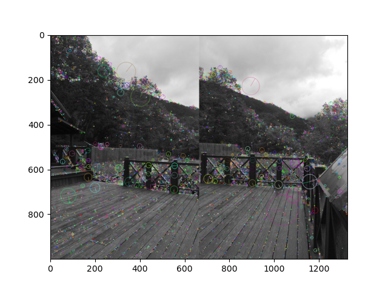

# Assigment 1 Computer Vision
## Giulio Zani

## Testing the code
Please check the `README.md` in order to run the code on new images.

## Computing Corner Harris
The Corner Harris are computed as described in the assignment detail using `skimage.feature`. Afterwards the peaks and the corner subpix are computes using the same library and applied in this sample image.

## Selecting Descriptors
To select the descriptors and keypoints, I have used the `cv2.SIFT_create()` function. Resulting in the following image:

After the descriptors are extracted, they are selected based on their distance between all of the descriptors of the other image. This will yield a NxM matrix, where N is the number of descriptors found in the left image and M in the right. The minimum for each row is found and then the descriptors are selected usign a threshold that is *relative*. So if `t` is the threshold, and `k` is the number of descriptors:

$$ k = tN $$

As mentioned in the assigment description, there are two ways to compute the distance between two descriptors: *eucledian* and *normalized correlation*.
The results of both techniques are reported in the following subsections.
These results are based on the sensitivity analysis described in its corresponding section.

### Normalized Correlation
### Hyperparameters
| ransac iters | ransac sample size | ransac distance threshold | ransac accepted threshold | distance method | top matches |
|-----|-----|-----|-----|-----|-----|
| 10000 | 0.2 | 0.1 | 0.01 | correlation | 0.04 |

### Results
| accuracy | error |
|-----|-----|
| 0.07895 | 0.03056 |

### Euclidian Distance
### Hyperparameters
| ransac iters | ransac sample size | ransac distance threshold | ransac accepted threshold | distance method | top matches |
|-----|-----|-----|-----|-----|-----|
| 10000 | 0.2 | 0.1 | 0.01 | euclidean | 0.04 |

### Results
| accuracy | error |
|-----|-----|
| 0.07895 | 0.06185 |

As we can see the error is lower for the normalized correlation.

## Ransac 
While implementing the Ransac algorithm, I have tried as much as possible to use *relative* thresholds.
This is because the number of descriptors and the sample size are not known in advance and thus using relative thresholds makes the algorithm more robust.
At every iteration, the ransac computes the ratio inliers/outliers and the mean error.
At the end of the iteration process, models are selected first on basis of the ratio and then on basis of the mean error. Both these selections use relative thresholds.

## Sensitivity Analisys 
As requested, I have performed a sensitivity analysis on the Ransac algorithm using the ratio number of inliers/number of outliers.
This is one of the two metrics presented.
The other one is the error on the remaining sample of the model seleted by the Ransac algorithm. The error is thus based on MSE (mean squared error). The error is computed as follows:

$$||f1'-f2||_2^2$$

Where `f1` and `f2` are the matching keypoints of the two images, and `f1'` are the keypoints after applying a model.

The accuracy is given by:

$$\frac{i}{i + o}$$

Where `i` is the number of inliers and `o` is the number of outliers (which are also selected on the basis of the euclidian distance).

## Stitching images
To stitch the images, we first compute the corners of the left image.
Then we apply the model selected by Ransac to them and get a translation matrix which we can use to warp our image using the `cv2.warpPerspective` function. Then we create a new model based on this translation matrix and apply it the right image to get also the right warped image.
Once we have both images warped we can stitch them together by looping through every pixel. We will select non-black pixel of each image (if any).

## Experimenting with Hyperparameters

To find out the optimal hyperparameters, I have created a loop that evalues the error of the model for different values given by a range.

### Top Matches
Top matches is a hyperparameter that defines a relative threshold for the number of matches. The higher the value, the more matches are selected. Its possible maximum value is 1, but in practice even for values higher than 0.3, the algorithm becomes very slow.
Below are shown results for 10 values between 0.01 and 0.3.

Interestingly, the two metrics don't seem to be proportional to each others.

### Accuracy Threshold
Given the accuracies of all the models, the accuracy threshold selects the top percentage of the models that will subsequently be selected according to error.

